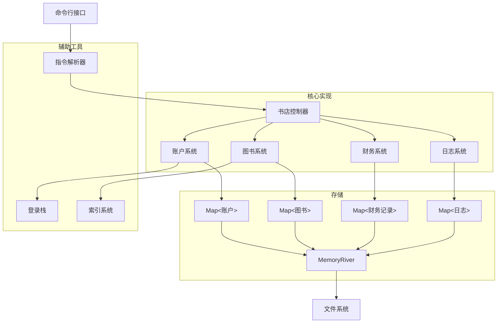
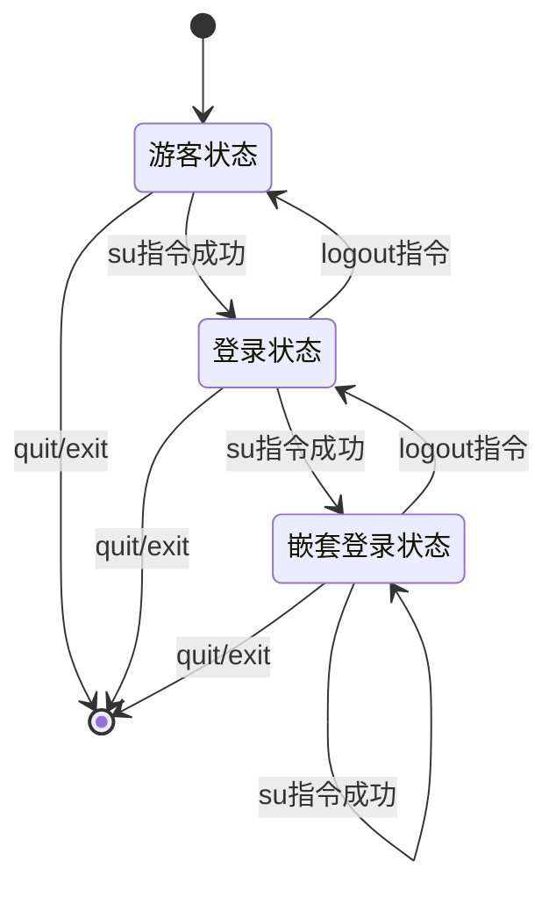
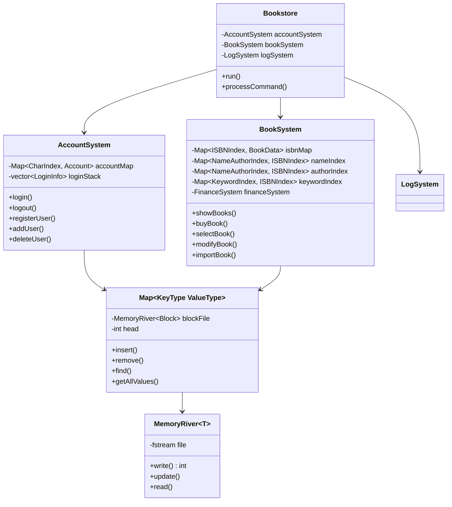

# 书店管理系统BookStore总体设计文档

>文档作者：王文轩

- 12.12初稿 持续更新
- 12.25代码实现完成，二稿

## 程序功能概述

本项目是一个基于C++的命令行书店管理系统，严格遵循《业务要求》和《标准要求》文档规范。系统面向四类用户角色（游客、顾客、销售人员、店长），实现完整的图书销售业务管理功能。


## 主体逻辑说明



### 嵌套登陆栈机制



## 代码文件结构

```plain
bookstore/
├── main.cpp                    # 程序入口
├── include/                    # 头文件目录
│   ├── bookstore.h            # 书店主控制器
│   ├── account.h              # 账户系统定义
│   ├── book.h                 # 图书系统定义
│   ├── map.h                  # 块状链表Map实现
│   ├── MemoryRiver.h          # 文件存储模板
│   ├── token.h               # 指令分词
│   ├── parser.h              # 指令解析
│   └── log.h                 # 日志系统
└── src/                       # 源文件目录
    ├── bookstore.cpp          # 控制器实现
    ├── account.cpp            # 账户系统实现
    ├── book.cpp               # 图书系统实现
    ├── token.cpp              # 分词实现
    ├── parser.cpp             # 解析器实现
    └── log.cpp                # 日志系统实现     

```

### 核心类关系图


## 数据库设计

```c++
struct Account {
int privilege;        // 权限等级 {7, 3, 1}
char UserID[31];      // 用户ID（唯一标识）
char Username[31];    // 用户名
char Password[31];    // 密码
};

struct BookData {
    char ISBN[21];        // ISBN号（唯一标识）
    char BookName[61];    // 书名
    char Author[61];      // 作者
    char Keywords[61];    // 关键词（|分隔）
    double Price;         // 单价
    long long Stock;      // 库存数量
};

struct FinanceRecord {
    double income;        // 收入
    double expense;       // 支出
};
```

