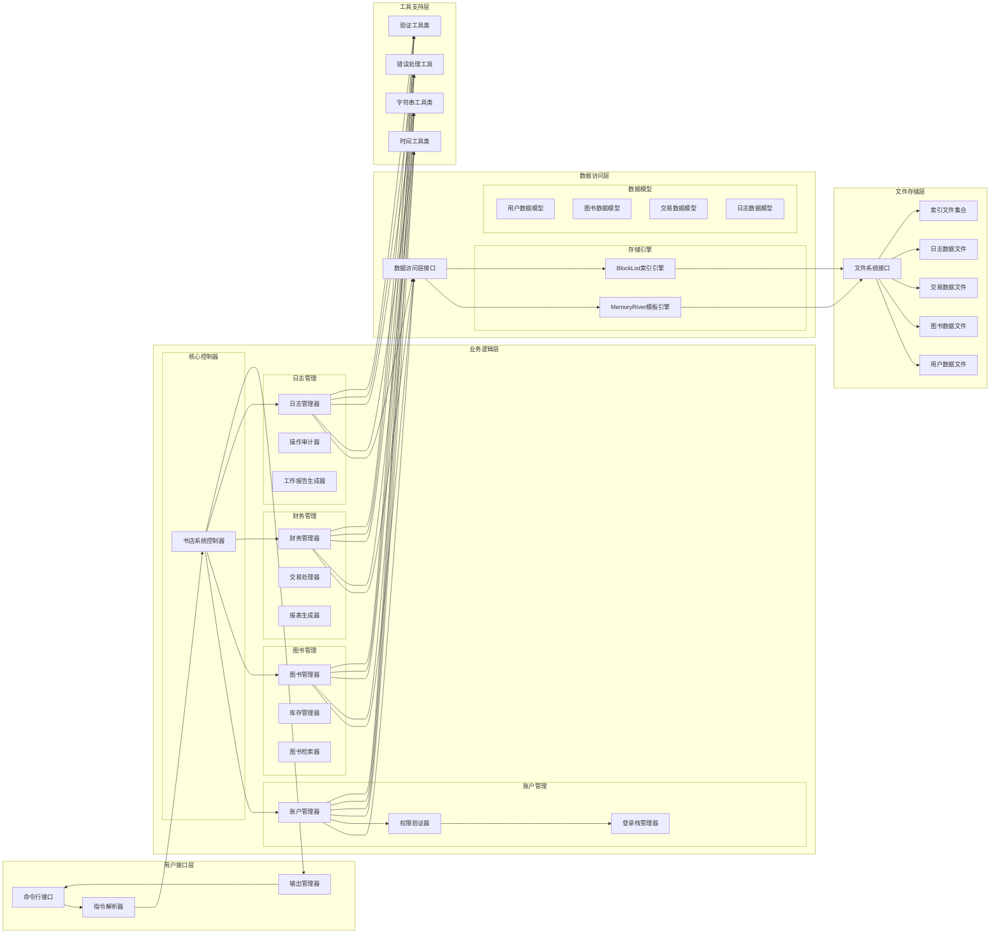
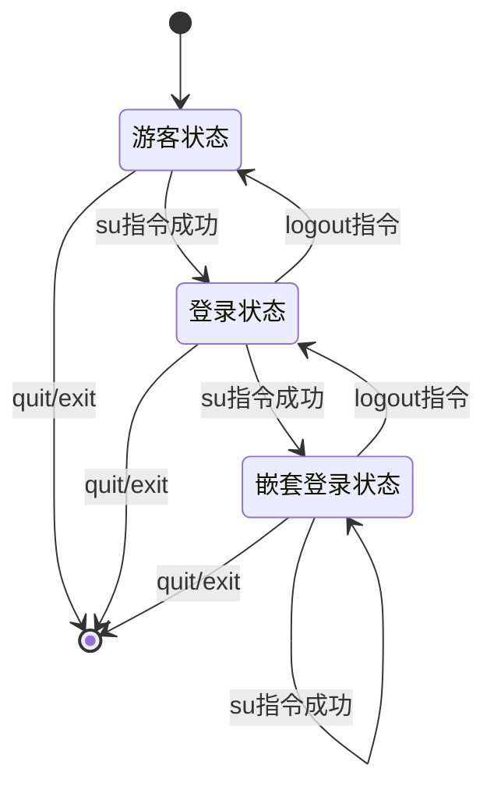
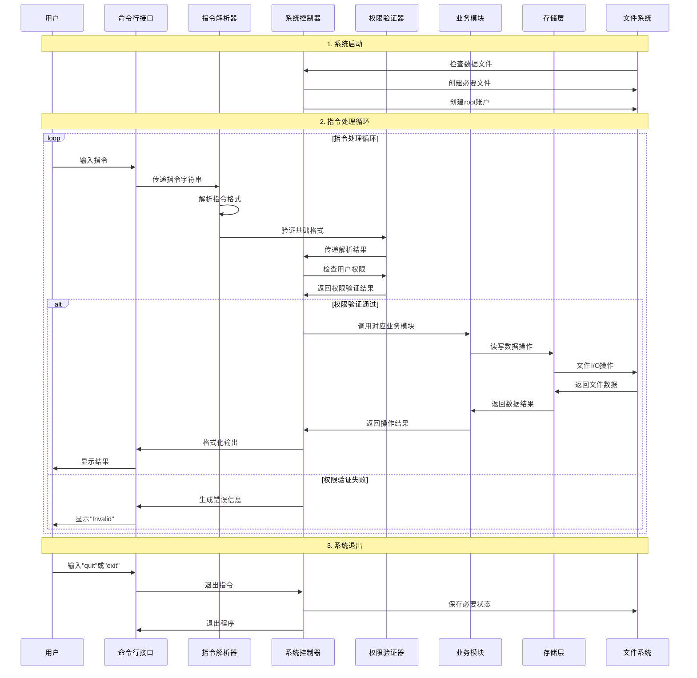
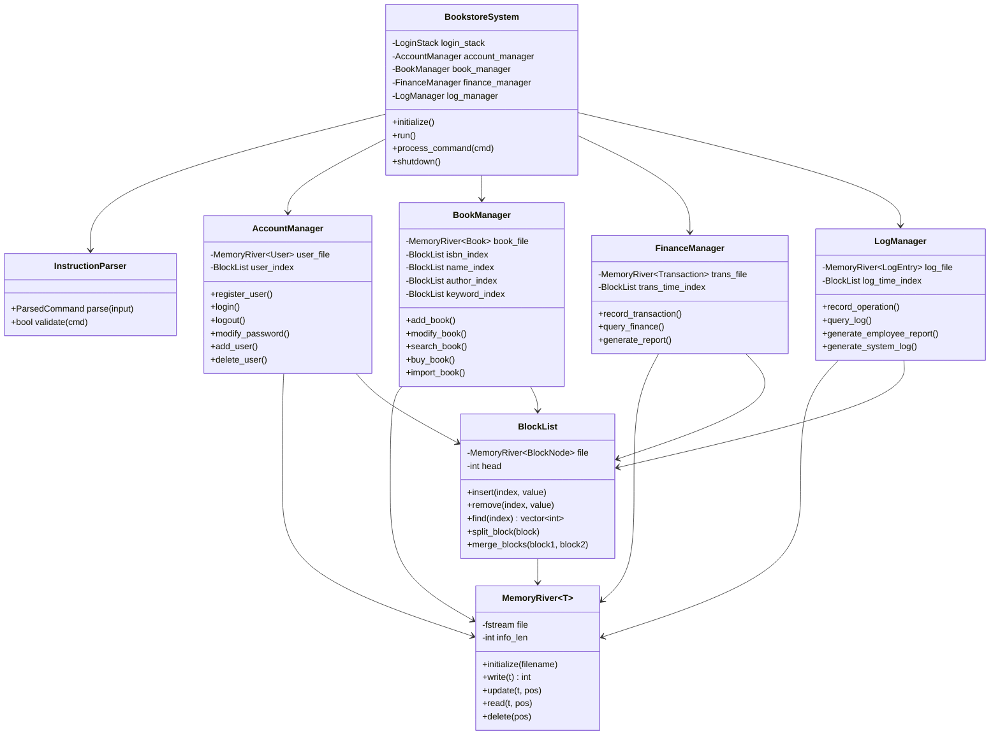

# 书店管理系统BookStore总体设计文档

- 文档作者：王文轩

- 12.12初稿 持续更新

## 程序功能概述

本项目是一个基于C++的命令行书店管理系统，严格遵循《业务要求》和《标准要求》文档规范。系统面向四类用户角色（游客、顾客、销售人员、店长），实现完整的图书销售业务管理功能。


## 主体逻辑说明



### 嵌套登陆栈机制



### 程序执行流程


## 代码文件结构

```plain
bookstore/
├── main.cpp                      # 程序入口点
├── src/                        # 工具类
│   ├── token.cpp
│   ├── people.cpp               # 用户类定义
│   ├── account.cpp       # 登录栈管理
│   ├── book.cpp   # 账户操作逻辑
│   └── log.cpp  
└── include/                     # 账户管理模块
    ├── token.h
    ├── people.h               # 用户类定义
    ├── account.h       # 登录栈管理
    ├── book.h   # 账户操作逻辑
    └── log.h        # 权限控制

```

### 核心类关系图


## 数据库设计

class account{ 权限 ID 密码password 用户名 }
class book{ ISBN BookName Author Keyword Quantity Price TotalCost }
class log{ Count }
## 类结构体设计

## 其他补充说明
