# 需求分析文档

## 1.业务流图

```mermaid
graph TB
    subgraph "入口"
        Start[开始] --> Visitor[游客]
    end

    subgraph "游客功能"
        Visitor -->|注册| Reg[用户注册]
        Visitor -->|登录| Login[用户登录]
    end

    subgraph "顾客功能"
        Login --> Customer[顾客]
        Customer -->|查询| Search[图书查询]
        Customer -->|购买| Buy[购买图书]

    end

    subgraph "销售人员功能"
        Login --> Sales[销售人员]
        Sales -->|继承| Customer
        Sales -->|进货| Import[图书进货]
        Sales -->|信息录入| AddBook[录入图书]
        Sales -->|信息修改| ModifyBook[修改图书信息]
        Sales -->|用户创建| CreateUser[创建用户]
    end

    subgraph "店长功能"
        Login --> Manager[店长]
        Manager -->|继承| Sales
        Manager -->|查询采购| QueryPurchase[采购查询]
        Manager -->|查询销售| QuerySales[销售查询]
        Manager -->|查询盈利| QueryProfit[盈利查询]
        Manager -->|查看工作报告| WorkReport[工作报告]
        Manager -->|查看系统日志| SystemLog[系统日志]
    end

    subgraph "数据存储"
        Search -->|读取| BookDatabase[(图书数据库)]
        Buy -->|更新| BookDatabase
        Import -->|更新| BookDatabase
        AddBook -->|新增| BookDatabase
        ModifyBook -->|修改| BookDatabase
        CreateUser -->|更新| UserDatabase[(用户数据库)]
        QueryPurchase -->|读取| TransDatabase[(交易数据库)]
        QuerySales -->|读取| TransDatabase
        QueryProfit -->|读取| TransDatabase
        WorkReport -->|读取| LogDatabase[(操作日志数据库)]
        SystemLog -->|读取| LogDatabase
    end

```

## 2.数据流图

## 3.数据词典

### 3.1 用户数据
| 数据项 | 含义 |
|--------|------|
| 用户ID | 用户的唯一标识符 |
| 用户名 | 用户登录时使用的名称 |
| 密码 | 用户登录密码 |
| 权限等级 | 用户的权限级别（0:顾客, 1:销售, 2:店长） |
| 登录状态 | 用户当前是否在线 |
| 登录时间 | 用户最近一次登录的时间 |
| 创建时间 | 用户账户创建的时间 |

### 3.2 图书数据
| 数据项 | 含义 |
|--------|------|
| ISBN | 图书的国际标准书号，唯一标识一本图书 |
| 书名 | 图书的名称 |
| 作者 | 图书的作者姓名 |
| 关键词 | 描述图书内容的关键词，多个用竖线分隔 |
| 库存量 | 图书当前的库存数量 |
| 单价 | 图书的销售价格 |
| 进货价 | 图书的进货成本价格 |
| 总进货量 | 图书历史累计进货总量 |
| 总销售量 | 图书历史累计销售总量 |
| 录入时间 | 图书信息首次录入系统的时间 |
| 更新时间 | 图书信息最近一次修改的时间 |

### 3.3 交易数据
| 数据项 | 含义 |
|--------|------|
| 时间戳 | 交易发生的时间 |
| 操作员ID | 执行交易操作的用户ID |
| 交易类型 | 交易的类型（0:销售, 1:进货） |
| ISBN | 交易涉及的图书ISBN |
| 数量 | 交易的数量 |
| 单价 | 交易时的单价 |
| 总价 | 交易的总金额（数量×单价） |

## 4. 功能说明

### 4.1 文件存储模块 (MemoryRiver类)

**模块名称**: MemoryRiver<T>  
**功能描述**: 内存与外存交互的核心类，提供模板化的文件读写操作，实现数据持久化存储

**输入参数**:
- 文件路径名 (string)
- 数据对象 (T类型)
- 操作类型 (get_info/write_info/write/update/read/delete)

**输出结果**:
- 文件操作状态
- 数据对象或整型信息
- 写入位置索引

**处理逻辑**:
1. 使用fstream进行二进制文件操作
2. 文件头部存储info_len个整型信息
3. 支持数据对象的顺序写入和随机读写
4. 提供位置索引机制进行数据定位
5. 实现数据的外存持久化存储

### 4.2 块节点类 (BlockNode)

**模块名称**: BlockNode  
**功能描述**: 块状链表中的基本存储单元，存储特定索引范围的键值对数据

**输入参数**:
- 块容量参数
- 数据插入请求 (index, value)
- 数据查找条件

**输出结果**:
- 块节点内部数据列表
- 插入/删除操作结果
- 查找匹配结果

**处理逻辑**:
1. 每个块节点存储约√n个数据条目
2. 块内数据按(index, value)对排序存储
3. 维护块内数据量和索引范围
4. 实现二分查找加速数据操作
5. 支持块内数据的有序插入和删除

### 4.3 块状链表类 (BlockList)

**模块名称**: BlockList  
**功能描述**: 管理整个块状链表系统，协调数据操作和块结构维护

**输入参数**:
- 操作指令 (insert/delete/find)
- 索引字符串 (≤64字节)和值参数
- 系统配置参数

**输出结果**:
- 操作执行结果状态
- 查询结果列表 (按值升序)
- 系统状态信息

**处理逻辑**:
1. 基于MemoryRiver实现外存数据管理
2. 维护块链表结构在文件中的存储
3. 实现完整的数据操作接口
4. 动态调整块结构保持性能平衡

#### 4.3.1 插入操作 (BlockList::insert)
**功能描述**: 向块状链表中插入新的(index, value)键值对

**输入参数**:
- index: 索引字符串
- value: 整型值

**输出结果**:
- 插入成功/失败状态
- 块结构调整信息

**处理逻辑**:
1. 验证索引-值对的唯一性约束
2. 根据索引定位合适的插入块
3. 在目标块中执行有序插入
4. 检查并处理块分裂条件
5. 更新索引映射信息

#### 4.3.2 删除操作 (BlockList::remove)
**功能描述**: 从块状链表中删除指定的(index, value)键值对

**输入参数**:
- index: 索引字符串
- value: 整型值

**输出结果**:
- 删除成功/失败状态
- 块结构调整信息

**处理逻辑**:
1. 定位包含目标数据的块
2. 在块内查找并删除指定条目
3. 检查并处理块合并条件
4. 更新相邻块的关系
5. 处理删除不存在条目的情况

#### 4.3.3 查找操作 (BlockList::find)
**功能描述**: 查找指定索引的所有值，按升序返回结果

**输入参数**:
- index: 索引字符串

**输出结果**:
- 值列表 (按升序排序)
- null (无匹配结果时)

**处理逻辑**:
1. 根据索引定位所有相关块
2. 在每个块中收集匹配的索引值
3. 合并所有匹配的值
4. 对值列表进行升序排序
5. 格式化输出结果

#### 4.3.4 块分裂操作 (BlockList::splitBlock)
**功能描述**: 当块数据量过大时，将块分裂为两个较小的块

**输入参数**:
- 待分裂的块指针
- 分裂阈值参数

**输出结果**:
- 新创建块的指针
- 分裂后块关系信息

**处理逻辑**:
1. 检查块数据量是否超过阈值
2. 计算分裂点位置
3. 创建新块并分配数据
4. 更新块链表指针关系
5. 同步分裂信息到外存

#### 4.3.5 块合并操作 (BlockList::mergeBlocks)
**功能描述**: 当相邻块数据量过小时，将两个块合并为一个

**输入参数**:
- 待合并的块指针 (两个相邻块)
- 合并阈值参数

**输出结果**:
- 合并后的块指针
- 合并操作状态

**处理逻辑**:
1. 检查相邻块数据量是否低于阈值
2. 计算合并后数据总量
3. 执行数据迁移和合并
4. 更新块链表指针关系
5. 释放空块资源并同步外存

## 5.用户交互设计    （我自己设计？） 初稿

## 5.1 通用命令格式

1. 查询
- 输入：query [ISBN号] [书名] [作者] [关键字] （任选一个或几个）
- 输出：[ISBN号] [书名] [作者] [关键字] [价格] [库存量]

2. 购买
- 输入：buy [ISBN号] [买几本]
- 输出：[ISBN号] [书名] [作者] [关键字] [价格] [库存量]

3. 进货
- 输入：stock [ISBN号]  [进了几本] [进货价格]
- 输出：[ISBN号] [书名] [作者] [关键字] [价格] [库存量]

4. 图书信息录入
- 输入：entry [ISBN号] [书名] [作者] [关键字]  [价格] [库存]
- 输出：[成功/失败]

5. 图书信息修改
- 输入：update 原来[ISBN号] [书名] [作者] [关键字]  [价格] [库存] 更新[ISBN号] [书名] [作者] [关键字]  [价格] [库存]
- 输出：[成功/失败]

6. 用户创建
- 输入：build [用户名] [id] [权限]
- 输出：[成功/失败]

7. 注册
- 输入：register [用户名] [id] [权限]
- 输出：[成功/失败]

8. 登录
- 输入：log [用户名] [id] 
- 输出：[成功/失败]

9. 查询采购信息
- 输入：purchase-query [开始时间] [结束时间]
- 输出：
  采购时间: [时间]
  ISBN号: [ISBN号]
  图书名称: [书名]
  数量: [采购数量]
  单价: ¥[进货价格]
  总价: ¥[总金额]
  操作员: [员工ID]

10. 销售情况
- 输入：sales-query [开始时间] [结束时间]
- 输出：
  销售时间: [时间]
  ISBN号: [ISBN号]
  图书名称: [书名]
  数量: [销售数量]
  单价: ¥[销售价格]
  总价: ¥[总金额]
  顾客ID: [顾客ID]

11. 盈利信息
- 输入：profit-query [开始时间] [结束时间]
- 输出：
  收入统计:
  总销售额: ¥[总收入]
  支出统计:
  总采购成本: ¥[总成本]
  运营成本: ¥[其他成本]
  总支出: ¥[总支出]
  利润统计:
  毛利润: ¥[毛利润]
  净利润: ¥[净利润]

12. 工作情况报告
- 输入：work-report [员工ID] [开始时间] [结束时间]
- 输出：？不知道都输出哪些信息

13. 整体工作日志
- 输入：system-log [开始时间] [结束时间] [日志级别]
- 输出：？不清楚日志的概念和范围

